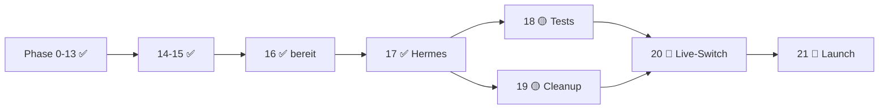
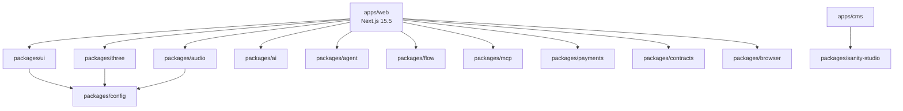

# Opus 4.7 → 4.8 Handoff

> [!IMPORTANT]
> **Branch:** `feature/phase-18-19-tests-and-prd-docs` @ `63d0f66`
> **Vorgänger:** [[OPUS_46_HANDOFF]] | **Ground Truth:** [[PRE_FLIGHT_PROTOCOL]]
> **Token-Rule:** Wenn etwas unklar ist, lies die referenzierte Datei. Nie raten.

---

## 🗺️ MOC — Map of Content

```dataview
TABLE date, status, commit
FROM #handoff OR #ground-truth OR #elbtronika
SORT date DESC
```

### Quick-Links
- [[STATUS]] — Projekt-Ampel
- [[AGENTS]] — Bootstrap-Guide
- [[TASKS]] — Aktive Arbeitspakete
- [[Architekturplan_v1.3]] — Phasen 1–22
- [[PRE_FLIGHT_PROTOCOL]] — 17-Section Agent-Bibel
- [[HERMES_TRUST_HARNESS]] — Waves 0–8
- [[OPUS_48_HANDOFF_PROMPT]] — Copy-paste für Claude CoWork

---

## 🔴 P0 — Sofort-Aktionen

```tasks
not done
sort by priority
```

| Priority | Task | Blocker | Recovery |
|----------|------|---------|----------|
| 🔴 | Tests wiederherstellen | Context-Compaction löschte 8 Dateien | `git show c4b3103 --name-only` |
| 🔴 | Lint-Fixes wiederherstellen | 30+ Dateien zurückgesetzt | `git diff 66dd8da..c4b3103` |
| 🟡 | Turbo OOM fixen | `pnpm typecheck` crasht | [[Turbo_OOM_Fix]] |
| 🟢 | STATUS.md aktualisieren | Phase 18–19 fehlen | Edit direkt |

---

## 📊 Projekt-Ampel



| Phase | Status | Owner | Key File |
|-------|--------|-------|----------|
| 0–13 | ✅ | Copilot/Sonnet | `main` |
| 14–15 | ✅ | Kimi K-NN | 104 Tests, Lighthouse, ZAP |
| 16 | ✅ | Kimi K-NN | Staging/Prod Deploys |
| 17 | ✅ | Sonnet 4.6 | [[HERMES_TRUST_HARNESS]] |
| **18** | 🟡 **AKTIV** | Codex 5.3 | `feature/phase-18-19-tests-and-prd-docs` |
| **19** | 🟡 **AKTIV** | Codex 5.3 | Pre-Pitch-Cleanup 5 Sub-Sprints |
| 20 | 🔵 | Lou (Lee-OK) | Live-Switch |
| 21 | 🔵 | Lou | Public Launch |

---

## 🧠 Knowledge Graph

### Packages (14) — [[Package_Index]]



### Test-Status — [[Test_Status]]

| Package | Tests | Status | Verloren? |
|---------|-------|--------|-----------|
| web | 24 passing | ✅ | 38 Tests verloren |
| audio | 16 | ✅ | — |
| ai | 8 | ✅ | — |
| payments | 6 | ✅ | — |
| mcp | 4 | ✅ | — |
| three | 2 | ✅ | — |
| flow | 0 | — | — |

> [!WARNING]
> **Verlorene Tests (aus `c4b3103`):**
> - `__tests__/ui/demo-banner.test.tsx` (5)
> - `__tests__/ui/walkthrough-tour.test.tsx` (11)
> - `__tests__/landing/hero.test.tsx` (3)
> - `__tests__/env/mode.test.ts` (6)
> - `__tests__/shop/demo-mode.test.tsx` (3)
> - `__tests__/stripe/demo.test.ts` (4)
> - `__tests__/press/press-kit.test.tsx` (1)
> - `__tests__/pitch/dashboard.test.tsx` (1)
> - `__tests__/supabase/admin.test.ts` (4)

---

## ⚠️ Anti-Patterns — [[NEVER_AGAIN]]

> [!CAUTION]
> Diese Fehler kosteten jeweils 15–60 Minuten. Niemals wiederholen.

### E1–E12 — Die Session-3 Fehler

| ID | Fehler | Root Cause | Prevention |
|----|--------|------------|------------|
| E1 | `// biome-ignore` in JSX Return | Biome parsed JS-Comment nicht | `{/* biome-ignore ... */}` oder vor Element |
| E2 | `key={\`step-${i}\`}` | Biome erkennt `i` trotzdem | `key={step.title}` oder `key={v}` |
| E3 | `vi.fn(function(){})` als Konstruktor | Intern Arrow-Function | `class MockS3Client {}` |
| E4 | `--unsafe` auf großen Packages | Formatiert zu viel | `--write` (safe) first |
| E5 | Turbo parallel typecheck | 14× tsc = OOM | `concurrency: 2` in turbo.json |
| E6 | `env.VAR!` ohne Prüfung | Biome noNonNullAssertion | `const v = env.VAR; if(!v) throw` |
| E7 | Canvas Tainting in Playwright | `drawImage(canvas,...)` auf selbem Canvas | `browser.newContext()` pro Bild |
| E8 | Fehlende Barrel Exports | Vitest conditions Error | Alles in `packages/ui/src/index.ts` |
| E9 | jest-dom in Vitest | Package nicht im Workspace | Plain Vitest matchers |
| E10 | Supabase CLI via npm | Kein Windows binary | `winget install Supabase.CLI` |
| E11 | Doppler ENV unvollständig | `ELT_MODE`, `MCP_AUDIT_DB` fehlen | `doppler secrets set` |
| E12 | Multiline commit ohne `-F` | PowerShell bricht ab | `git commit -F D:\msg.txt` |

### 😱 Schock-Momente

> [!BUG]
> **Context Compaction löscht Dateien.**
> 62 Unit Tests + 30 Lint-Fixes wurden zwischen Sessions entfernt.
> **Lesson:** Nach jeder grünen Verifikation sofort `git add && git commit`.

> [!BUG]
> **Biome `noConsole` = `"warn"` liefert Exit-Code 1.**
> `pnpm lint` failt wegen Warnings, nicht Errors.
> **Lesson:** Entweder `--no-error-on-warnings` oder `noConsole: "off"`.

> [!BUG]
> **Turbo parallel = OOM.**
> 14 Packages gleichzeitig = >8GB RAM Verbrauch.
> **Lesson:** `concurrency` limitieren oder sequentiell laufen.

---

## 🪟 Windows Survival — [[Windows_Rules]]

1. **`.cmd` Pflicht:** `pnpm.cmd`, `npx.cmd`, `turbo.cmd`
2. **Semicolon chaining:** `cmd1; cmd2`
3. **Multiline commits:** `git commit -F D:\msg.txt`
4. **Bracket dirs:** `fs.mkdirSync("app/[locale]")` — nie Shell `mkdir`
5. **Biome:** `npx.cmd biome check --write .`

---

## 🛠️ Tool-Matrix

| Tool | Use-Case | Windows | NIE |
|------|----------|---------|-----|
| `pnpm.cmd install` | Deps | `.cmd` | `npm install` |
| `pnpm.cmd <script>` | Scripts | `.cmd` | `pnpm` ohne `.cmd` |
| `npx.cmd <pkg>` | One-off | `.cmd` | `npx` ohne `.cmd` |
| `biome check --write` | Lint/Format | — | ESLint/Prettier |
| `turbo run <task>` | Parallel | — | Lerna |
| `git commit -F` | Multiline | — | `-m` mit `\n` |
| `fs.mkdirSync` | `[locale]` dirs | Node.js | Shell `mkdir` |

---

## 🎯 Nächste Prompt für Opus 4.8

```markdown
# Opus 4.8 — Bootstrap & Recovery

## 0. Pre-Flight (5 Min)
```bash
cd D:\Elbtronika\Elbtonika
git status && git log --oneline -3
pnpm.cmd --filter @elbtronika/web test  # 24 Tests müssen passen
```

## 1. P0 — Tests wiederherstellen (30 Min)
```bash
git show c4b3103 --name-only  # Liste der verlorenen Dateien
git show c4b3103:apps/web/__tests__/ui/demo-banner.test.tsx > apps/web/__tests__/ui/demo-banner.test.tsx
# ... repeat for all 8 files
```
- Verify: `pnpm.cmd --filter @elbtronika/web test` → 62+ Tests passing

## 2. P1 — Lint grün (30 Min)
- Option A (schnell): `biome.json` → `noConsole: "off"`
- Option B (sauber): Alle `console.*` durch `@/src/lib/logger` ersetzen
- Verify: `pnpm.cmd lint` → Exit-Code 0

## 3. P1 — Turbo OOM (15 Min)
- Edit `turbo.json`: `"typecheck": { "dependsOn": ["^build"], "concurrency": 2 }`
- Verify: `pnpm.cmd typecheck` → grün

## 4. P2 — STATUS.md (10 Min)
- Phase 18 + 19 als 🟡 markieren
- Verlorene Arbeit dokumentieren
- Nächste Schritte für Lou

## 5. Abschluss
```bash
git add -A
git commit -F D:\msg.txt
git push origin feature/phase-18-19-tests-and-prd-docs
```

## 6. Handoff
- Aktualisiere `memory/handoffs/OPUS_48_HANDOFF.md`
- Schreibe nächste Prompt-Struktur für Opus 4.9
```

---

## 📎 Referenz-Index

| File | Purpose | Last Update |
|------|---------|-------------|
| [[STATUS]] | Projekt-Ampel | 2026-04-30 |
| [[AGENTS]] | AI Bootstrap | 2026-04-30 |
| [[TASKS]] | Arbeitspakete | 2026-04-30 |
| [[Architekturplan_v1.3]] | Phasen 1–22 | 2026-04-30 |
| [[PRE_FLIGHT_PROTOCOL]] | 17-Section Bibel | 2026-04-30 |
| [[HERMES_TRUST_HARNESS]] | Trust Waves 0–8 | 2026-04-30 |
| [[OPUS_48_HANDOFF_PROMPT]] | Claude CoWork | 2026-04-30 |
| `scripts/phase-20-cleanup.ps1` | Automation | 2026-04-30 |
| `scripts/install-dev-tools.ps1` | Tool Install | 2026-04-30 |

---

> [!TIP]
> **Golden Rule:** Committe früh, committe oft. Die Context Compaction ist gnadenlos.
> Wenn etwas grün ist → sofort in Git sichern.

---

#tags #handoff #opus-4.7 #elbtronika #ground-truth #recovery-needed
